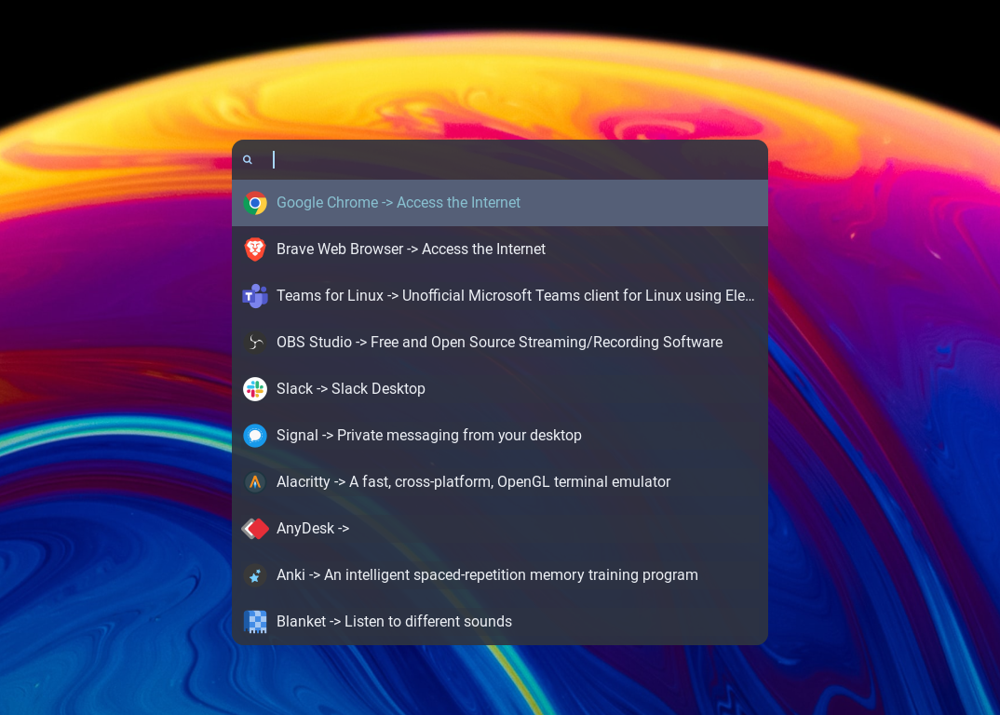
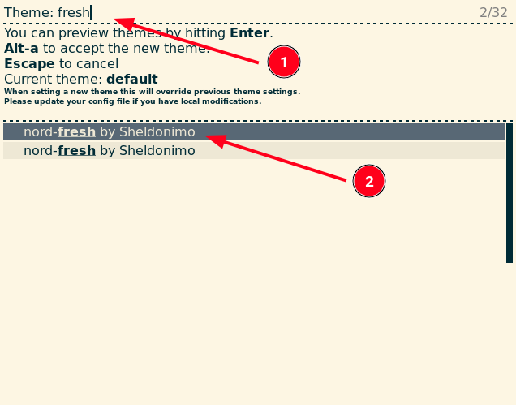

<div align="center" class="tip" markdown="1" style>

  

</div>

# 🌟 Fresh Theme for Rofi Launcher
Enhance your Rofi experience with the Fresh theme! This bash script makes it easy to install a sleek, modern theme for the Rofi launcher.

### :rocket: Fresh Theme Overview
<div align="center" class="tip" markdown="1" style>



</div>

## :star2: Prerequisites: Fonts Installation

For optimal display of some characters, it's recommended to install **Hack Nerd Font Mono** and/or **Fira Code**. These fonts ensure that all icons and special characters in the Fresh theme load properly. You can download and install these fonts from their respective websites:

- [Hack Nerd Font Mono](https://www.nerdfonts.com/font-downloads)
- [Fira Code](https://github.com/tonsky/FiraCode)

## :computer: Installation

To install the Fresh theme, simply clone the repository and run the installation script:
```bash
git clone https://github.com/Sheldonimo/fresh-rofi-theme.git
cd fresh-rofi-theme
chmod +x install.sh
./install.sh
```
### :gear: Configuration

- **For Linux Mint users:** The default configuration will be automatically set during installation.
- **For other distributions:** The `rofi-theme-selector` will be activated after installation. Follow these steps to select the Fresh theme:
  1. Search in the rofi-theme-selector interface 'fresh' .
  2. Use the keyboard to navigate and select the Fresh theme.
  3. Press `Enter` to apply the Fresh theme as your default.

#### 📸 How to Select the Theme
<div align="center">



*Image showing how to use the rofi-theme-selector to choose the Fresh theme.*

</div>

## :zap: Using the Fresh Theme

After installing the Fresh theme for Rofi, enhance your experience with this simple command:

```bash
rofi -show-icons -modi drun -show drun
```

**Note:** For quick access, consider assigning this command to a keyboard shortcut in your system settings. This enables you to enjoy the Fresh theme's sleek interface with just a key press, making application launching faster and more convenient.

## 🛠 Optional: Don't Have Rofi Yet? Install It!

If you prefer to manually install Rofi, use the following commands depending on your distribution:

- On Debian / Ubuntu: `apt-get install rofi`
- On Arch / Arch-based: `pacman -S rofi`
- On Fedora: `dnf install rofi`

**Note:** These manual steps are optional if you're using our installation script. The script automatically checks if Rofi is installed and, if not, proceeds with the appropriate installation for your system.

> 📚 Want to learn more about setting up Rofi, including keyboard shortcuts? Find additional information [here](https://github.com/davatorium/rofi).


## What is Rofi?

Rofi is a versatile and efficient tool that functions as a window switcher, application launcher, and a replacement for dmenu. Initially developed as a clone of simpleswitcher, Rofi has evolved to include additional features like an application launcher and ssh-launcher. It offers a user-friendly textual list interface for various actions, such as running applications, selecting windows, or executing options from external scripts. Rofi's functionality makes it a valuable tool for streamlining user interactions on a computer. More information about Rofi and its capabilities can be found on its [GitHub page](https://github.com/davatorium/rofi).
